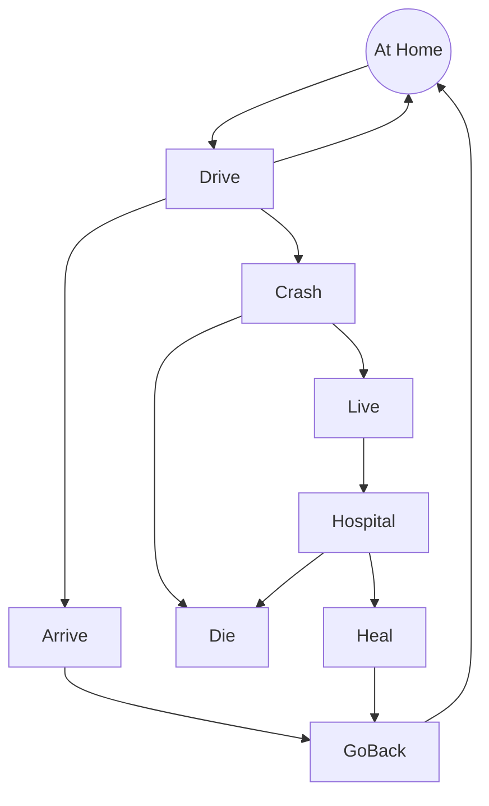
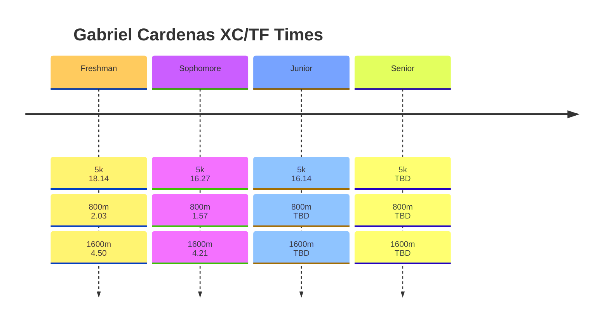

# gccardenas.github.io
This repo exists to store information about gccardenas. Check ABOUT.md for information.

## My Mermaid Charts

### The Cycle of Driving

```mermaid
graph TD;
    Home((At Home))-->Drive;
    Drive-->Crash
    Drive-->Arrive
    Crash-->Die;
    Arrive-->GoBack
    GoBack-->Home;
    Crash-->Live;
    Live-->Hospital;
    Hospital-->Die;
    Hospital-->Heal;
    Heal-->GoBack
    Drive-->Home

```
## Timeline of Running Times

``` mermaid
%%{init: { 'logLevel': 'debug', 'theme': 'base' } }%%
timeline
    title Gabriel Cardenas XC/TF Times
    Freshman: 5k <br> 18.14 :   800m <br> 2.03 : 1600m <br> 4.50
    Sophomore: 5k <br> 16.27 :   800m <br> 1.57 : 1600m <br> 4.21
    Junior: 5k <br> 16.14 :   800m <br> TBD : 1600m <br> TBD
    Senior: 5k <br> TBD :   800m <br> TBD : 1600m <br> TBD
```
